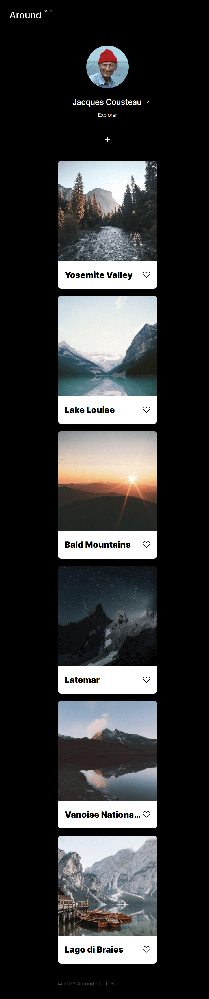
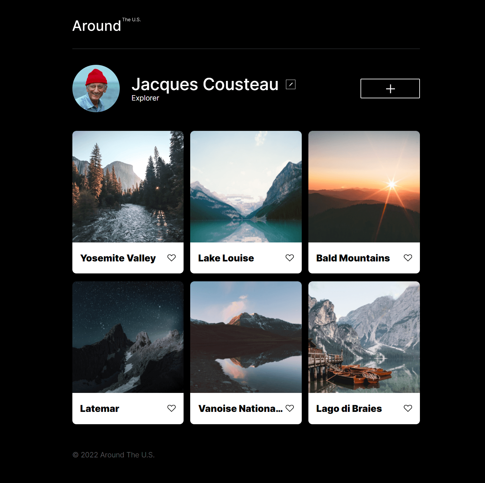

# Project 3: Around The U.S.

### Overview

- Intro
- Website
- Images

**Intro**

This is the third project of the Software Engineer program at Practicum. It was created using HTML and CSS, based on the Figma design. This has a responsive layout and was designed to be displayed correctly across all the popular devices.

**Website**

https://germino45.github.io/se_project_aroundtheus/

**Images**

Mobile Device:

Tablet:

Desktop:

